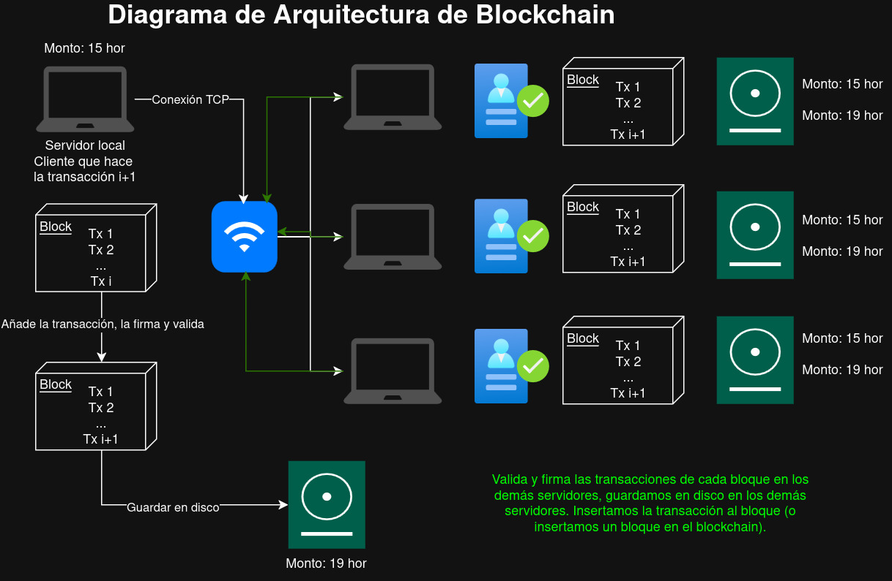

# Blockchain Project Documentation

## 🎯 Motivación

Este proyecto busca demostrar cómo los sistemas de criptomonedas, como Bitcoin o Ethereum, aplican principios sólidos de **ciberseguridad y matemáticas avanzadas** para permitir a los usuarios interactuar sin intermediarios (como bancos), garantizando:

- Autenticidad sin conocer al emisor.
- Integridad sin depender de terceros.
- Seguridad sin que el usuario sea experto técnico.

Inspirados por estos conceptos, implementamos una blockchain funcional desde cero en Go, reforzando los principios éticos y técnicos de la seguridad de los datos.

---

## ✅ Objetivos alcanzados

| Área             | Objetivo                                                                 |
|------------------|--------------------------------------------------------------------------|
| 🔐 Seguridad     | Validación automática de transacciones, uso exclusivo de claves propias. |
| 📡 Networking    | Reenvío (broadcast) funcional entre nodos usando TCP puro.               |
| ⚙️ Funcionalidad | Wallets, firma, bloque génesis, propagación de transacciones.            |
| 📦 Módulos       | Validación de inputs/outputs, control de UTXOs, comparación de hashes.   |

---

## ❌ Objetivos pendientes

| Área         | Falta implementar                                                                 |
|--------------|-----------------------------------------------------------------------------------|
| 🖥️ Interfaz  | CLI para usuarios: enviar, recibir, revisar balance, crear wallets.               |
| 📡 TLS       | Al implementar las medidas de seguridad respectivas, optamos por usar TCP Puro.   |

---

## 🔧 Requerimientos

### ✅ Funcionalidadess implementadas:
- Generación llaves públicas/privadas y direcciones (hashear la llave pública del emisor mediante SHA3-256).
- Generación y firmas de las transacciones P2P (peer to peer) usando ECDSA (r||s) con curva P-256.
- Validación automática de transacciones al recibirlas: pubKey + firma + TxOut.
- Generación de bloque génesis con fondos iniciales distribuidos a múltiples wallets.
- Minar bloques (con PoW).
- Broadcasting de transacciones válidas entre nodos conectados por TCP.
- Gestión de UTXOs para cada wallet: solo se pueden gastar salidas propias.
- Estructura modular: wallets, blockchain, transacciones y nodos separados.
- Guardar y actualizar el estado del blockchain local.
- Simulación en red real (server.go, client.go).

### 🔐 Requerimientos de seguridad implementados:
- Firma digital mediante ECDSA con curva P-256 (NIST).
- Criptografía asimétrica para autenticidad mediante curva elíptica (ECDSA/secp256k1).
- Hashing con SHA3-256 para integridad de las llaves, transacciones y bloques.
- Validación de firma + dirección para cada TxIn antes de aceptar transacción.
- Validación del prev_hash para asegurar continuidad del blockchain.
- Aislamiento de claves privadas en disco (wallet.json) con advertencia educativa.

### 🧱 Próximos pasos:
- ❗ GUI o interfaz CLI para usuarios (ver llaves, balance, transacciones).

### 🧱 Ideas futuras:
- ❗ Conexión TLS para certificado y autenticación más robustos.

---

## 📁 Estructura del Proyecto

Este proyecto implementa una blockchain básica en Go con arquitectura modular separada en dos directorios principales:

### 📂 /cmd - Aplicaciones Ejecutables
Contiene las aplicaciones de línea de comandos del proyecto:

#### 🏦 cmd/initial/ - Generador del bloque Génesis
- **Archivo**: send_to_wallet.go
- **Propósito**: Generador del bloque génesis con distribución de fondos
- **Funcionalidad**:
  - 3 salidas (TxOut) por wallet (2 wallets = 6 salidas)
  - Asigna 1,000,000 HORUS coins por wallet
  - Las direcciones (lockingScript) corresponden al address generado con SHA3(pubKey)
  - Permite que cada nodo (con su wallet), pueda firmar y enviar transacciones que consuman UTXOs de su propiedad.
  - Validación automática entre nodos.

#### 🏦 cmd/wallet/ - Generador de Carteras
- **Archivo**: key_creation.go
- **Propósito**: Crear y gestionar carteras criptográficas
- **Funcionalidad**:
  - Genera dirección (address) como SHA3-256(pubKey) truncado 
  - Genera nuevas claves criptográficas ECDSA usando curva P-256
  - Crea archivos de cartera en formato JSON
  - Carga carteras existentes desde disco
  - Muestra información segura de la cartera (oculta claves privadas)
  - Implementa avisos de seguridad para el manejo de claves

#### 🌐 cmd/client/ - Cliente de Blockchain
- **Archivo**: client.go
- **Propósito**: Interactuar con el servidor de blockchain
- **Funcionalidad**:
  - Crea/carga carteras de cliente
  - Se conecta al servidor TCP en el puerto 8081
  - Construye y firma transacciones usando ECDSA
  - Envía transacciones al servidor con claves públicas para validación
  - Maneja respuestas del servidor

#### 🖥️ cmd/server/ - Servidor de Blockchain
- **Archivo**: server.go
- **Propósito**: Ejecutar el nodo servidor de blockchain
- **Funcionalidad**:
  - Escucha conexiones TCP en el puerto 8081
  - Acepta múltiples conexiones concurrentes
  - Procesa dos tipos de mensajes:
    - TRANSACTION:<json> - Transacciones con claves públicas
    - BLOCK:<json> - Bloques validados de otros nodos
  - Muestra información detallada de transacciones recibidas
  - Maneja configuración de nodos peer

### 📦 /pkg - Paquetes Reutilizables

#### 🔧 pkg/core/ - Lógica Central de Blockchain
Contiene la implementación principal de la blockchain:

##### blockchainserver.go
- **Clase**: BlockchainServer
- **Responsabilidades**:
  - Gestión de transacciones pendientes (mempool)
  - Minería de bloques con Proof of Work
  - Validación de bloques recibidos
  - Persistencia de blockchain en disco
  - Comunicación peer-to-peer
  - Validación de firmas ECDSA
- **Valiadción automática**:
  - Se extrae el TxIn, firma y pubKey.
  - Se obtiene la TxOut referida (PrevTx, PrevIndex).
  - Se valida que SHA3(pubKey) == LockingScript.
  - Se verifica que la firma ECDSA sea correcta.

##### wallet.go
- **Clase**: Wallet
- **Responsabilidades**:
  - Generación de claves ECDH/ECDSA P-256
  - Persistencia de carteras en JSON
  - Firma de datos con ECDSA
  - Generación de direcciones blockchain
  - Conversión entre formatos de claves

##### block.go
- **Clase**: Block
- **Responsabilidades**:
  - Estructura de bloques blockchain
  - Cálculo de hash SHA3-256
  - Implementación de Proof of Work
  - Validación de dificultad (bits de ceros)
  - Verifica continuidad (prev_hash) y validez de transacciones contenidas.

##### transaction.go
- **Clase**: Tx, TxIn, TxOut
- **Responsabilidades**:
  - TxIn: Firma, pubKey, puntero a TxOut anterior
  - TxOut: Monto, script que bloquea (address del receptor)
  - Valida: Que la firma sea válida, y que el pubKey pertenezca al locking script original
  - Hash de transacción con SHA3
  - Estructura de transacciones UTXO
  - Generación de IDs únicos
  - Validación de firmas ECDSA
  - Serialización para firma
  - Verificación de integridad

#### 🔐 pkg/crypto/ - Implementaciones Criptográficas
Implementaciones educativas de algoritmos de hash:

##### sha2_256.go
- **Funcionalidad**: Implementación completa de SHA-256 desde cero
- **Características**:
  - Funciones bitwise (rotación, desplazamiento)
  - Generación de constantes K y H
  - Padding de mensajes
  - Procesamiento por bloques de 512 bits

##### sha3_256.go
- **Funcionalidad**: Implementación completa de SHA3-256 desde cero
- **Características**:
  - Permutación Keccak-f[1600]
  - Padding pad10*1
  - Fases de absorción y exprimido
  - 24 rondas de transformación

##### Tests incluidos
- sha2_256_test.go y sha3_256_test.go con casos de prueba

## 🚀 Cómo Usar el Sistema

### 1. Generar una Cartera

bash
cd cmd/wallet
go run key_creation.go

### 2. Generar el Bloque Génesis

bash
cd cmd/initial
go run send_to_wallet.go

### 2. Ejecutar el Servidor

bash
cd cmd/server
go run server.go [peer1:port] [peer2:port]

### 3. Ejecutar el Cliente

bash
cd cmd/client
go run client.go

## 🔧 Arquitectura Técnica

### Seguridad Criptográfica
- **Curva Elíptica**: P-256 (NIST) para todas las operaciones
- **Firmas**: ECDSA con formato r||s (64 bytes) usadas para autorizar transacciones
- **Hash**: SHA3-256 para bloques, SHA-256 para direcciones
- **Llaves**: Generación con crypto/ecdh y conversión a ECDSA para firma

### Protocolo de Red
- **Transporte**: TCP puro (puerto 8081)
- **Formato**: Mensajes JSON estructurados
- **Tipos**: TRANSACTION: (transacción firmada y validada) y BLOCK: (bloque completo minado)
- **Concurrencia**: Goroutines para múltiples conexiones

### Consenso
- **Algoritmo**: Proof of Work
- **Dificultad**: Configurable (bits de ceros)
- **Minería**: Búsqueda incremental de nonce
- **Validación**: Cada bloque revisa integridad del prev_hash, firmas de transacciones, y estructura general

### Persistencia
- **Formato**: JSON para carteras y blockchain
- **Archivos**: wallet.json, blockchain.json (el bloque génesis no está en disco, pero el servidor sabe que está por defecto)
- **Sincronización**: Mutex para acceso concurrente
- **Estado en memoria**: Se utilizan mapas (map[string]*Tx, map[string]*TxOut) para rastrear UTXOs y validaciones automatizada.

---

## 🔄 Workflow del sistema

---

## ⚠️ Consideraciones de Seguridad

- Las claves privadas se almacenan en texto plano en JSON
- Implementación educativa, no para producción
- Firma digital implementada con ECDSA con curva P-256
- Seguridad garantizada mediante hashing con SHA3-256 para address, transacciones y bloques
- Exclusividad, pues solo se pueden gastar salidas (TxOut) si firmas con privKey y validas con pubKey
- Validación sí y solo sí el input coincide con el locking script (address)

## 🧪 Propósito Educativo

Este proyecto está diseñado para demostrar:
- Conceptos fundamentales de blockchain
- Criptografía aplicada (ECDSA, SHA)
- Arquitectura de sistemas distribuidos
- Protocolos de consenso
- Networking TCP en Go
- Correcto maneja de criptografía con validación de bloques y transacciones

---

## 🧠 Lecciones aprendidas

- La validación de firmas y modular la estructura de una transacción from scratch es desafiante.
- Golang es excelente para concurrencia y manejo de redes TCP.
- Trabajar en red real presentó dificultades en sincronización de estados y seguridad en el funcionamiento del blockchain.

- Implementar UTXOs correctamente con firma y validación no es trivial.
- El manejo de claves entre ECDH y ECDSA requiere entendimiento cuidadoso de los formatos.
- Validar transacciones en red real presentó desafíos, pero fue superado exitosamente.

## 🧑‍🤝‍🧑 Retrospectiva

- ✅ Buen diseño de módulos desde el inicio facilitó la extensión del código.
- ✅ Organización clara en ramas (main, testing_tcp) permitió separar pruebas locales y reales.

- ✅ Implementar un blockchain demuestra todo el esfuerzo que hay detrás, para que usuarios confíen en invertir en una criptomoneda sin necesidad de una entidad reguladora como un banco.
- ✅ Excelente curva de aprendizaje y conocimiento compartido.
- ❌ Hubo dificultades iniciales con la validación y sincronización de nodos.

## CONCLUSIÓN

Este proyecto implementa los fundamentos clave de un sistema blockchain:

    Criptografía asimétrica.

    Hashing seguro.

    Transacciones tipo UTXO.

    Validación distribuida.

    Comunicación entre nodos en red real.

Todo desde cero, y en un entorno real de red. Si bien aún puede expandirse con interfaces más robustas o economía de red, cumple completamente su propósito educativo, ético y técnico que demuestra el funcionamiento de un blockchain.

*Proyecto desarrollado con fines educativos para el curso de Ética y Seguridad de los Datos*s